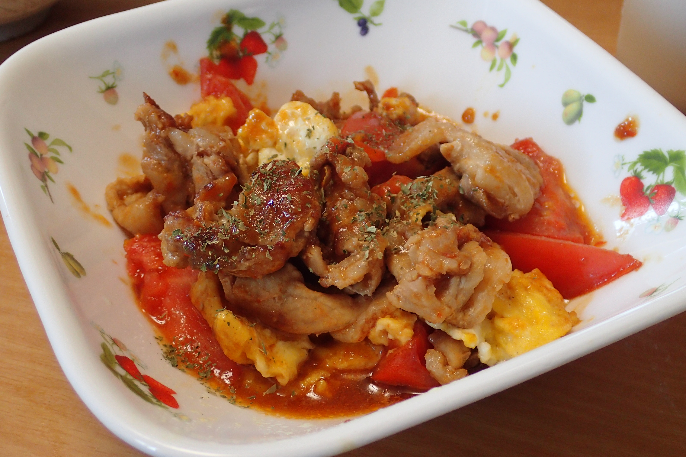

# 豚肉とトマトの卵炒め

## 調理時間

30分程度

## 元ネタ

* [レタスクラブニュース](https://www.lettuceclub.net/recipe/dish/21869/)

## 食材(1人前)

* 豚肉：100g程度
* 卵
  * 卵：1～2個
  * 塩こしょう：少々
* トマト：1個

## 調味料

* サラダ油：少々
* にんにくペースト：少々
* しょうがペースト：少々
* 途中で加える調味料(☆)
  * 豆板醤：小さじ2分の1
  * オイスターソース：小さじ2杯
  * 醤油：小さじ1杯

## 調理機材

* フライパン
* 計量カップ
* ボウル
* まないたと包丁

## 手順

### 下準備

* 卵を溶いておき、塩こしょうを少しかけておく
* 豚肉を食べやすいサイズに切り分ける
* トマトは8等分程度に切り分けておく

### 調理手順

1. フライパンを中火であたため、サラダ油を敷き、卵を入れる
2. 卵が固まってきたら、いったん皿によける
3. フライパンに必要なら再度サラダ油を加え、豚肉とにんにく・しょうがペーストを炒める
4. 豚肉の色が変わってきたら、トマトを加えて引き続き炒める
5. トマトが少し崩れてきたら調味料(☆)を加え、ついで2で皿によけた卵を戻す。
6. 10秒程度かき混ぜて完成。
