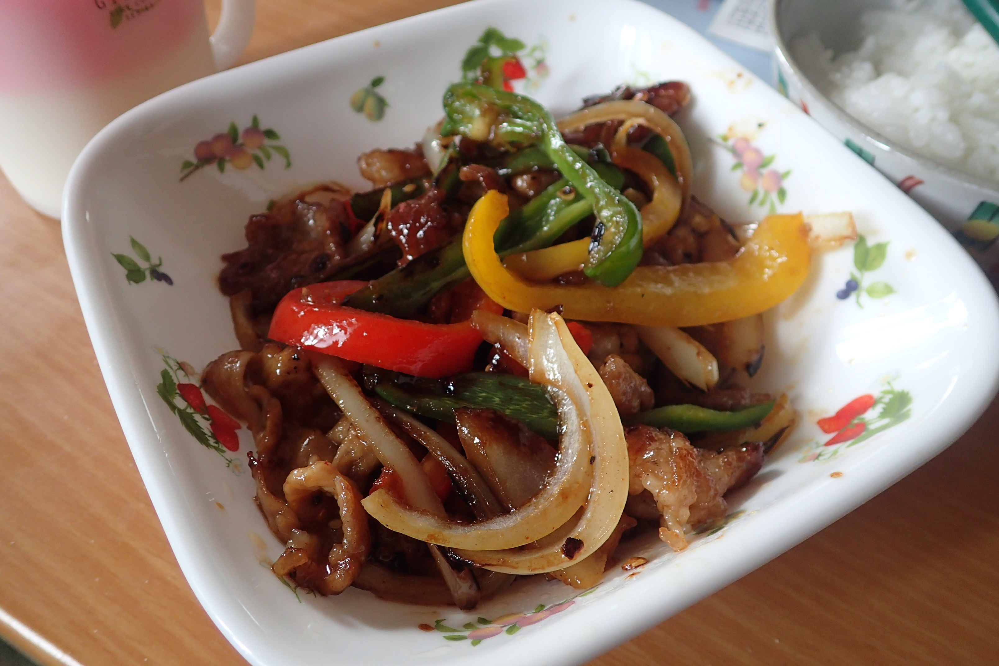

# 豚肉とパプリカの炒め物

## 調理時間

30分強

## 元ネタ

[Cookpadレシピ](https://cookpad.com/recipe/4239258)

## 食材(1人前)

* 豚肉：100g前後
* パプリカ：2分の1個(赤黄両方使う場合は4分の1個ずつ)
* ピーマン：一個
* たまねぎ：4分の1個

## 調味料

* ごま油
* かたくり粉：20gくらい
* 焼き肉のタレ

## 調理機材

* フライパン
* まないた
* 包丁
* ボウル

## 手順

### 下準備

* 豚肉の準備
  1. かたくり粉20g程度をしっかりまぶす
* パプリカ・たまねぎ・ピーマンを千切り。パプリカとピーマンはへたを取っておくと良いです

### 調理手順

1. ごま油をしいたフライパンで豚肉を炒める
1. 色が変わったら一度豚肉を皿に移す
1. パプリカ・たまねぎ・ピーマンを炒める。
1. 野菜が少し柔らかくなってきたら2で皿に移した豚肉をフライパンに移す
1. 焼き肉のタレをかけて、しっかり混ぜる
1. お好みの味になってきたら完成

## トッピング案

* しめじ(かなり量が増えるので二人前以上のときに？)
* たまご(炒り卵)
