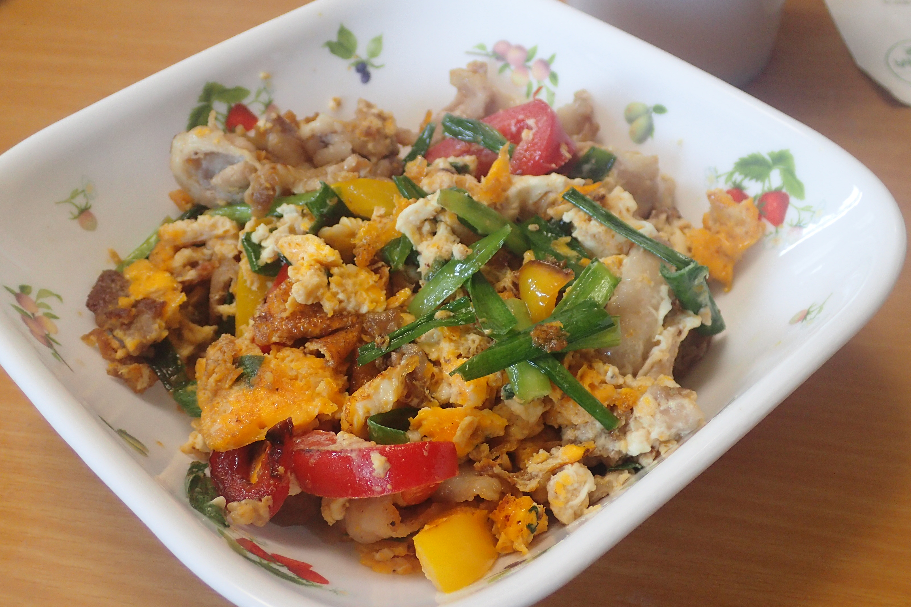

# 豚肉パプリカとにらの彩り玉子炒め

## 調理時間

25分程度

## 元ネタ

* [パプリカ・にらの彩り卵炒め by 大福さん 【クックパッド】 簡単おいしいみんなのレシピが314万品](https://cookpad.com/recipe/1290637)

## 食材(1人前)

* 豚肉：100gくらい
* 赤パプリカ：1/4個
* 黄パプリカ：1/4個
* にら：3束
* 卵：2個

## 調味料

* ごま油：少々
* 醤油：小さじ2杯
* 料理酒：小さじ3杯
* 黒こしょう：少々

## 調理機材

* フライパン
* 計量カップ
* ボウル
* まないたと包丁

## 手順

### 下準備

* 赤・黄パプリカを千切りにする
* にらを3cm程度に切り分ける
* 卵を溶いておく

### 調理手順

1. フライパンを中火であたため、ごま油を敷き、豚肉を炒める
2. 片面の色が変わってきたら(1分程度目安)、肉をひっくり返しつつ、赤・黄パプリカを入れる
3. パプリカがやや柔らかくなってきたら(1分程度目安)、ニラを加える
4. にらがしんなりしてきたら、溶き卵を加え、軽く混ぜる
5. 卵が固まってきたら、しあげに醤油と料理酒を加え、少し軽く混ぜ、完成
