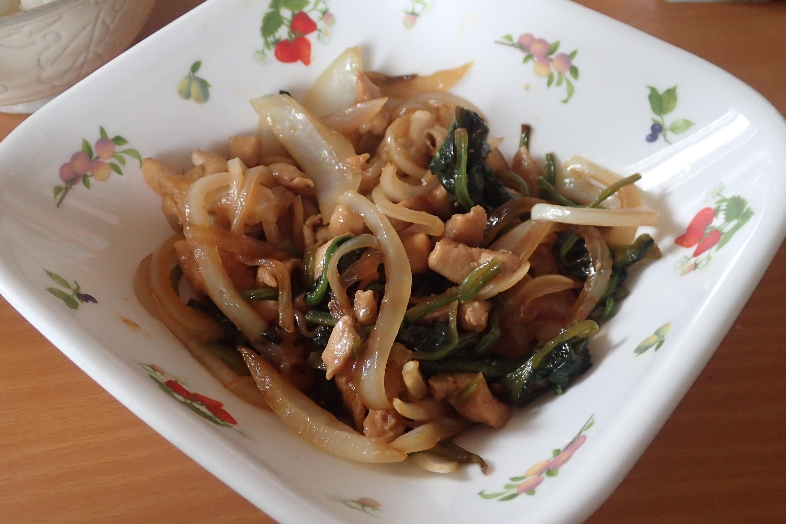

# 鶏とほうれん草のオニオンソテー(α)

## 調理時間

30分くらい

## 元ネタ

[Cookpadレシピ](https://cookpad.com/recipe/486057)

## 食材(1人前)

* 鶏肉：100g前後
* ほうれん草：2，3束
* たまねぎ：4分の1個

## 調味料

* サラダ油：少々
* 塩こしょう：少々
* 醤油：大さじ1杯
* みりん：大さじ1杯

## 調理機材

* 計量カップ
* まな板
* 包丁
* フライパン
* なべ
* ざる(水切り用)

## 手順

### 下準備

* ほうれん草を5cm間隔ほどにきりわけ、お湯で茹でる
* 醤油とみりんを混ぜておく

### 調理手順

1. サラダ油を引いたフライパンで、中火で鶏肉を炒める。
2. 色が変わりかけてきたら、軽く水を切ったほうれん草を混ぜ、かき混ぜる
3. ほどなくたまねぎを入れ、醤油・みりん・塩こしょうを加え、混ぜる

## 備考

* ちょっと量が少ないので他の食材を加えると良さそう
* 鶏肉の炒め時間が長くなるため、あらかじめかたくり粉などをまぶしておくと良さそう
