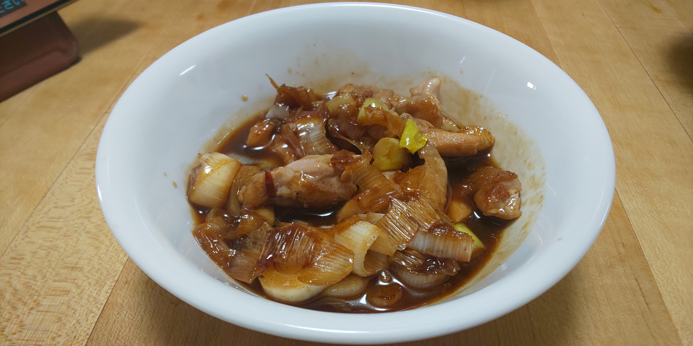

# 鶏肉とネギの焼き鳥風照り焼き

## 調理時間

20分くらい

## 元ネタ

* [鶏肉とネギの焼き鳥風照焼き by リンゴdeクック 【クックパッド】 簡単おいしいみんなのレシピが356万品](https://cookpad.com/recipe/6785248)

## 食材(1人前)

* 鶏肉：100g前後
* ねぎ：2分の1本

## 調味料

* あわせだれ
  * 醤油：大さじ2杯
  * ハチミツ：大さじ1杯
  * 料理酒：大さじ1杯
* サラダ油：少々

## 調理器材

* 調理ばさみ
* フライパン

## 手順

### 下準備

* ねぎを2，3cm間隔で輪切りにする(フライパンの上で直接切ると手っ取り早い)

### 調理手順

1. サラダ油を引いたフライパンで、中火で鶏肉を炒める
2. 色が変わりかけてきたら、輪切りにしたネギを加える
3. ネギに焼き色がついてきたら、あわせだれを加えて軽く混ぜて、できあがり
