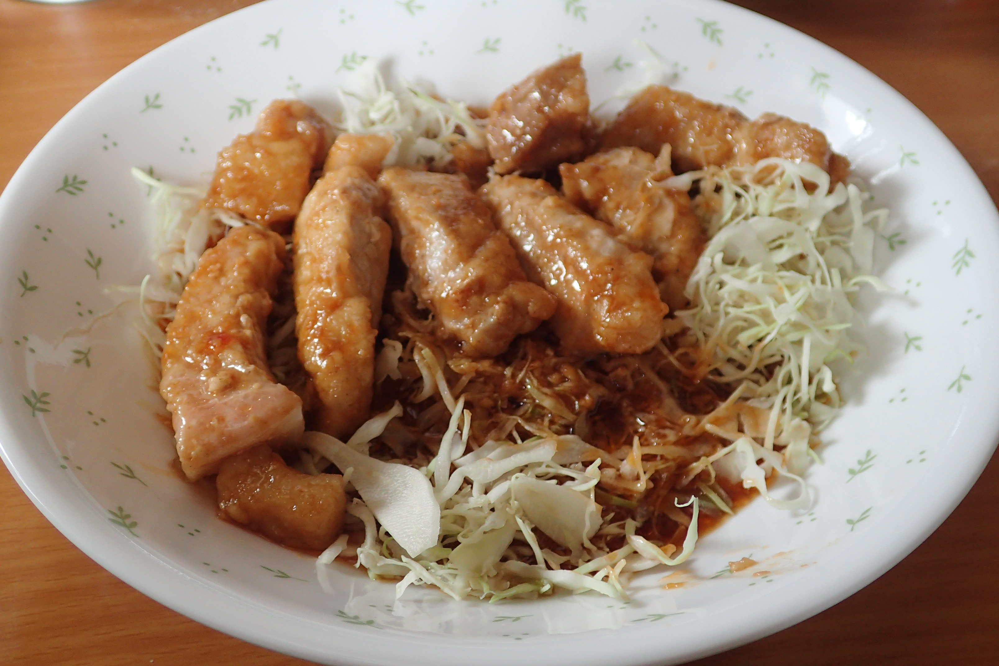

# 厚切り豚ロースの甘酢ケチャップ炒め

## 調理時間

30分くらい

## 元ネタ

[Cookpadレシピ](https://cookpad.com/recipe/4904931)

## 食材(1人前)

* 厚切り豚ロース肉：1枚

## 調味料

* 酢：大さじ2分の1杯
* 醤油：大さじ2分の1杯
* 料理酒：大さじ1杯
* みりん：大さじ2分の1杯
* ケチャップ：大さじ2分の1杯
* 砂糖：大さじ2分の1杯
* オイスターソース：2，3滴
* 小麦粉(強力粉)：少々(ロース肉を覆う程度)
* 塩こしょう：少々
* サラダ油：少々

## 調理機材

* フライパン
* 計量カップ
* まな板
* 包丁

## 手順

### 下準備

* 厚切り豚ロース肉を1.5cm間隔に切り分け、塩こしょうと強力粉をまぶす
* 酢～オイスターソースまでの調味料を混ぜ合わせる(★)

### 調理手順

1. 豚ロース肉を、油を敷いたフライパンに入れ、中火で炒める。両面色が変わるまでじっくり焼く
2. ★のタレを豚ロース肉の上にかけて、かき混ぜながら炒める。30秒程度で火を止め出来上がり

## 備考

* 千切りキャベツ100g前後を下敷きにするとちょうど良い感じになります。
