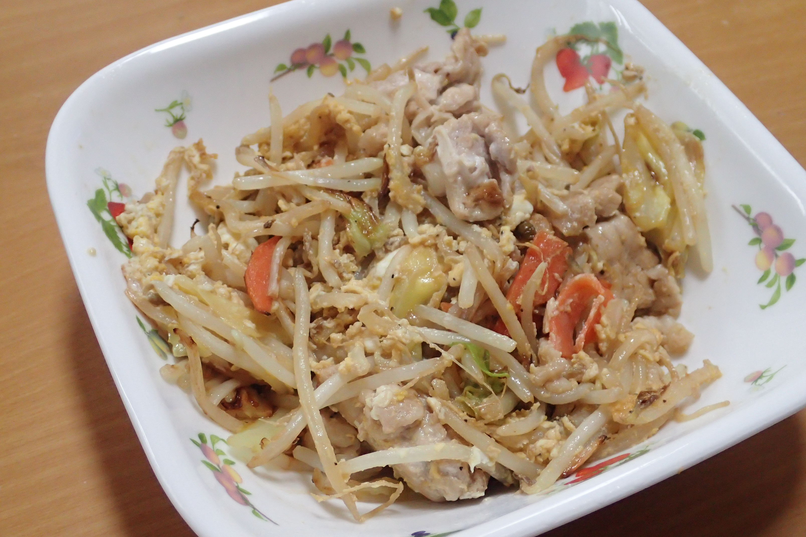

# 炒り卵入り野菜炒め

いつもの朝ご飯より短時間で作れる。片付け時間も同じくらい短いので、忙しいときにはお勧め

## 調理時間
15分前後

## 元ネタ

なし

## 食材(1人前)
- コンビニの炒め野菜セット：二分の一袋
- 豚肉：100g前後
- たまご：一つ

## 調味料
- サラダ油
- オイスターソース
- 塩こしょう

## 調理機材
- フライパン

## 手順

### 前準備

なし

### 調理手順

1. フライパンにサラダ油をしいて、豚肉と炒め野菜セットを炒める
1. 豚肉の色が変わってきたらオイスターソースと塩こしょうをかける
1. かき混ぜて味見。ちょうど良くなったら野菜炒めをひとかたまりにまとめる
1. その上にたまごを割り入れ、固まる前にかき混ぜて炒り卵にする
1. たまごが固まったら皿によそう

## トッピング例

* かたくり粉
  * 使う場合、オイスターソースと水を以下の分量で配合するとちょうど良い
  * オイスターソース：小さじ2、水小さじ5、かたくり粉：小さじ2 をかき混ぜて投入

## おまけ

5g程度の水溶き片栗粉を加えて混ぜても悪くないです(その場合、オイスターソースを少し増やします)。

プチトマトを添えても良いかも。