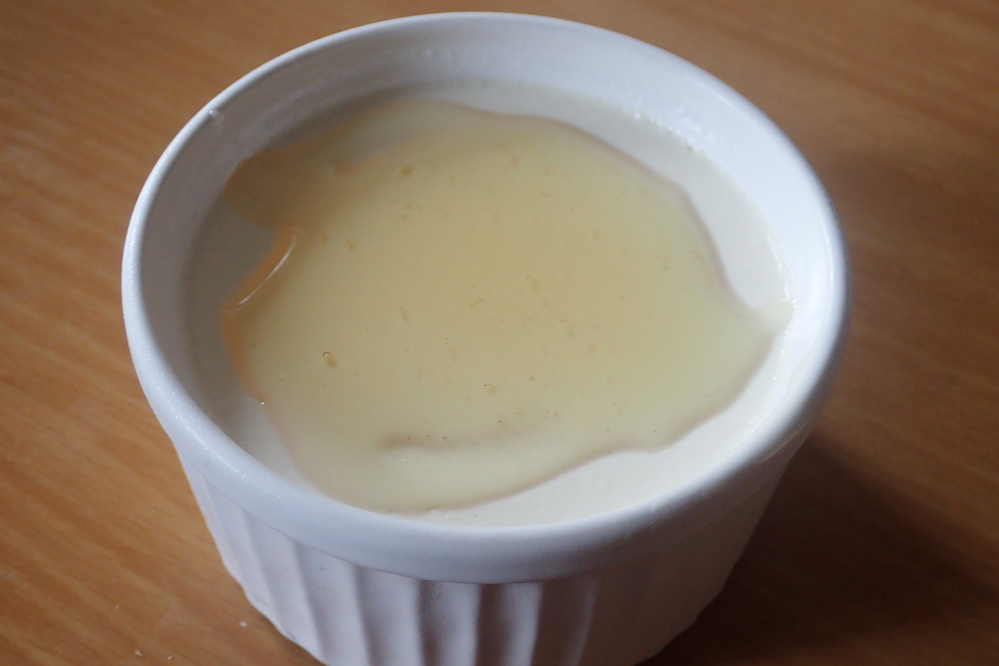

# 牛乳のパンナコッタ

## 調理時間

30分くらい＋1時間半～2時間

## 元ネタ

[Cookpadレシピ](https://cookpad.com/recipe/4052940)

## 食材(1人前)

* 牛乳：300ml
* 生クリーム：200ml
* 粉ゼラチン：5g
* バニラエッセンス：2, 3滴

## 調味料

* 砂糖：50g

## 調理機材

* 鍋
* 上記鍋をすっぽり覆うサイズのフライパンまたはボウル
* 計量カップ
* かき混ぜ用スプーン
* 調理機材とは別に、総容量560ml程度の器が必要(写真は容量140mlのココット。四つにわけて食べる)

## 手順

### 下準備

* 大きなフライパンに冷水を張っておく
* 粉ゼラチンを水でふやかしておく(最近のゼラチンは「ふやかし不要」と書いてあるものもあるが、ふやかさないとダマになる)

### 調理手順

1. 牛乳300mlを鍋にかけ、弱火で温める
1. 沸騰しかけたころに火を止め、バニラエッセンス、砂糖、生クリームを鍋に入れ、砂糖の感触を感じなくなるくらいまでよくかき混ぜる
1. 事前に水を張ったフライパンに鍋を浮かべ、粗熱をとる
1. 鍋に素手で触って熱いと感じなくなるくらいまで冷めたら、器によそう
1. 器ごと冷蔵庫に入れて、1時間半～2時間ほぼ冷やす

## トッピング例

* 蜂蜜小さじ一杯程度
* 生クリーム
* いちごジャム(元レシピの通り)

## 備考

過去のアレンジ例より

* 牛乳を豆乳に置換えると、味がかなり薄味になる。
* 粉ゼラチンを粉寒天に置換えると固まるのが早くなり冷やす時間も短縮可能(1時間弱でほぼ固まっていた)。どちらかというとババロアに近くなる。