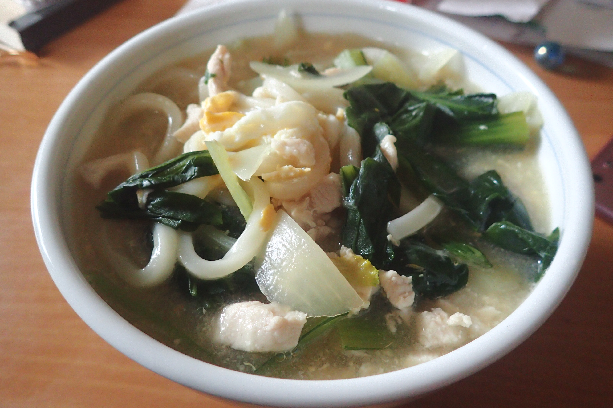

# 親子汁のうどん

## 調理時間

30分程度

## 元ネタ

* [Cookpadレシピ](https://cookpad.com/recipe/3912925)

## 食材(1人前)

* 鶏肉：100gくらい
* 小松菜：2束ほど
* たまねぎ：4分の1
* 冷凍うどん：一つ
* つゆ
  * 水：280ml
  * 白だし：20ml
  * かつお節だし：30ml
* たまご：一つ

## 調味料

* かたくり粉：10g

## 調理機材

* 鍋
* まないたと包丁
* ボウル

## 手順

### 下準備

* 小松菜を2, 3センチ幅に切る
* たまねぎを千切りにする
* 鶏肉にかたくり粉をまぶす
* たまごを溶いておく(鶏肉を鍋に入れたあとのボウルを使うと、ボウルを節約可能)
* 鶏肉を一口大のサイズに切り分けておく

### 調理手順

1. つゆを入れた鍋を中火で温める
1. 小さな泡が出始めてきた頃に、鶏肉・小松菜・たまねぎを投入(あれば鍋蓋をしておく)
1. 2, 3分ほど待ち、鶏肉の色が変わってきたら、冷凍うどんを入れる
1. 冷凍うどんがほぐれてきたら、溶き卵を回し入れる
1. 溶き卵が固まってきたらできあがり

## おまけ

* クリエイトSDなどに売っている小口切りの鶏肉を使うと、鶏肉を切り分ける手間が省けます(その場合汁の量がこのままだと、鶏肉が沈んでしまうので少し減らしたほうがいいかもしれません)