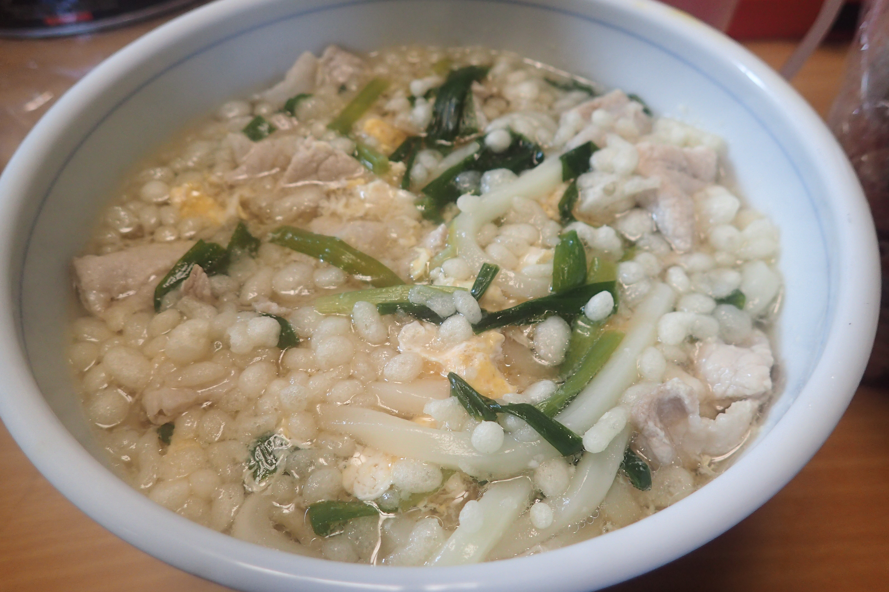

# 豚ニラ玉うどん

## 調理時間

20分程度

## 元ネタ

とくになし

## 食材(1人前)

* 豚肉：100g前後
* にら：4，5本
* 冷凍うどん：ひとつ
* たまご：ひとつ
* つゆ
  * 水：250cc
  * 白だし：50cc
  * 醤油：10cc

## 調味料

* とくになし

## 調理機材

* 鍋
* キッチンばさみ
* 計量カップ
* ボウル(うどんの器で代用可能)

## 手順

### 下準備

* 卵を溶いておく

### 調理手順

1. 鍋につゆを入れ、中火で温める
2. つゆが沸騰してきたら、鍋に豚肉を入れる
3. 続いてキッチンばさみでニラを3，4cm程度に切り分け、鍋に入れる
4. 肉の色が変わってきたら、冷凍うどんを入れる
5. 冷凍うどんがほぐれてきたら、溶き卵を回し入れる
6. 溶き卵が固まってきたらできあがり

## おまけ

* 天かすをいれてもいいと思います。