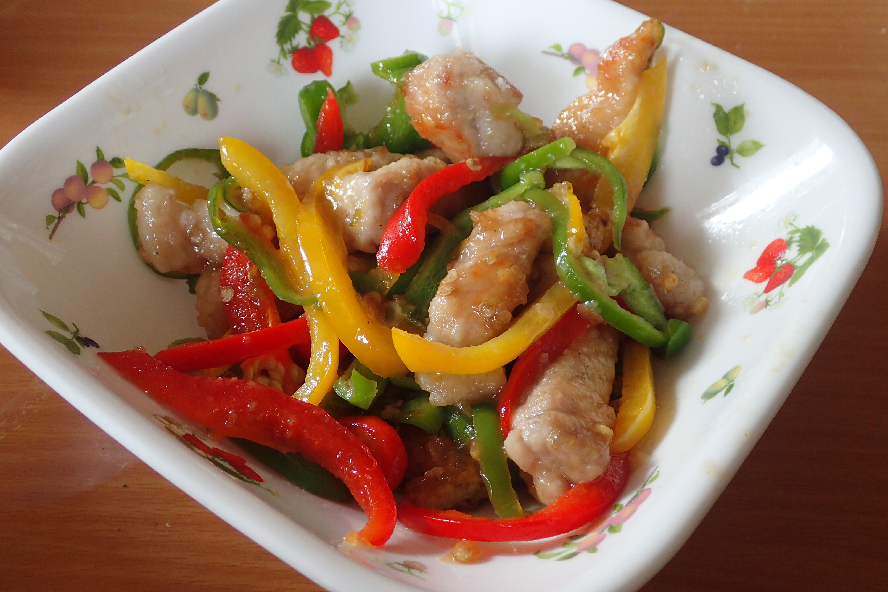

# 豚ロース肉とパプリカの甘酢炒め

## 調理時間

20分程度

## 元ネタ

[楽天レシピ](https://recipe.rakuten.co.jp/recipe/1330007966/)

## 食材(1人

* 厚切り豚ロース肉：一枚
* パプリカ：2分の1個(赤黄両方使う場合は4分の1個ずつ)
* ピーマン：一個

## 調味料

* 小麦粉：豚ロース肉を覆うくらい
* 塩こしょう：少々
* ポン酢：小さじ2杯
* みりん：小さじ2杯
* 料理酒：小さじ1杯
* 砂糖：小さじ2分の1杯
* 片栗粉：小さじ2分の1杯
* 鶏ガラスープの素：少々
* サラダ油：少々

## 調理機材

* フライパン
* ボウル
* 計量カップ
* まないた
* 包丁

## 手順

### 下準備

* 豚ロース肉を1センチ角程度の棒状に切る
  * 塩こしょうを少し振り、小麦粉をしっかりとまぶす
* ピーマン・パプリカを千切りにする(タネは残しておくと良いです)
* ポン酢・みりん・料理酒・砂糖・片栗粉・鶏ガラスープの素を混ぜる(★)

### 調理手順

1. サラダ油を敷いたフライパンに、棒状にした豚ロース肉を入れて、中火でじっくり焼く(フライパンが適温になってから90秒程度が目安)
1. 色が変わってきたら、豚ロース肉をひっくり返してさらに焼く(90秒程度が目安)
1. ピーマン・パプリカを追加し、かき混ぜながら30秒程度炒める
1. ★を混ぜ入れ、しっかりかき混ぜて、できあがり
