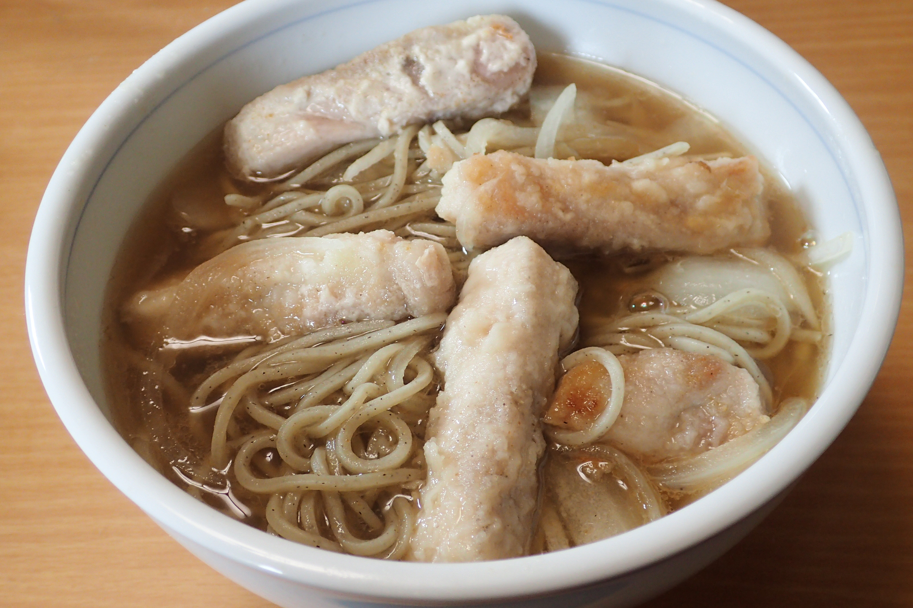

# 豚ロース肉のそば

## 調理時間

30分くらい

## 元ネタ

なし

## 食材(1人前)

* そば(使用したのは冷凍和そば)：一食分
* 厚切り豚ロース肉：1枚
* たまねぎ：四分の一玉

## 調味料

* サラダ油
* つゆ：300mlを目安に適量
  * 水：250ml
  * めんつゆ：30ml
  * みりん：20ml
* 小麦粉：豚ロース肉を覆うくらい
* 塩こしょう：少々

## 調理機材

* ボウル
* 計量カップ
* まないた
* 包丁

## 手順

### 下準備

* 豚ロース肉を2, 3cmほどに切り分け、塩こしょうを少々、小麦粉を全体にまぶす
* たまねぎを千切りにする

### 調理手順

1. 中火であたためたフライパンで、豚ロース肉を炒める(2分程度目安)
2. 豚ロース肉をひっくり返し、たまねぎを加え、さらに炒める(1分程度目安)
3. つゆを加えて、ややかき混ぜながら、やや泡が出てくるまで煮込む
4. そばを加えて、そばが柔らかくなるまでかき混ぜる
5. そばが柔らかくなってきたらできあがり

## その他

* そばはあらかじめレンジなどで戻しておいてもいいかも(豚ロース肉の衣が柔らかくなりすぎてしまうため)
* 塩こしょうは豚ロース肉にでなくつゆに振りかけた方が良いかも(結局そばつゆに入れた時点で、豚肉にかけた塩こしょうがつゆに溶け出すため)
