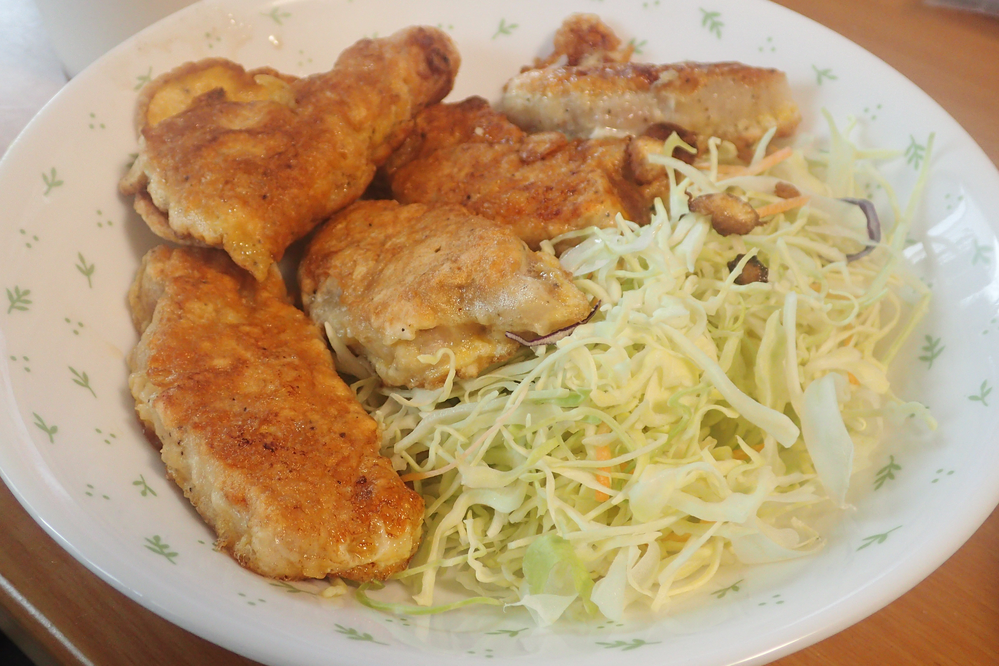

# 豚ロース肉のたまご揚げ

## 調理時間

30分強

## 元ネタ

[Cookpadレシピ](https://cookpad.com/recipe/3071459)

## 食材(1人前)

* 厚切り豚ロース肉：一枚
* たまご：一つ

## 調味料

* 塩こしょう：少々
* 小麦粉：豚ロース肉をまるごと包むくらい
* サラダ油

## 調理機材

* フライパン
* まないた
* 包丁
* ボウル

## 手順

### 下準備

* 豚ロース肉の準備
  1. 豚ロース肉を食べやすい大きさに切り分ける。おおよそ4分割くらいがちょうど良いです。
  1. 豚ロース肉の片面に塩こしょうをまぶす。ちょっと多めなくらいに振っておくと良いです
  1. その上から小麦粉をまぶす。両面肉の色が見えなくなるくらいに小麦粉をかけておくと良いでしょう。
* たまごをボウルにあけかきまぜ、たまご液を作る

### 調理手順

1. 油をしいたフライパンに、たまご液をたっぷりつけた豚ロース肉を敷き、両面を中火で2～3分ほど焼く
1. 終わったら適度なサイズの皿によそって完成
1. なお、たまご液があまったら、塩こしょうを足してからフライパンに入れ、卵焼きにするのもおいしいです。

## おまけ

コンビニ等で販売されているサラダミックスをそえると、立派なメインのおかずになります。
