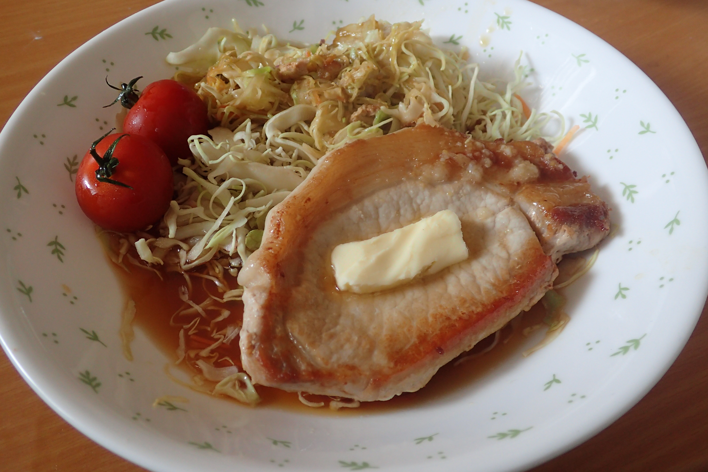

# 豚ロース肉のたまご揚げ

## 調理時間

10分程度

## 元ネタ

忘れました

## 食材(1人

* 厚切り豚ロース肉：一枚
* コンビニサラダミックス：2分の1袋
* バター：ひとかけ

## 調味料

* 塩こしょう：少々
* 料理酒：70cc
* 醤油：10cc
* サラダ油
* にんにくペースト：少々

## 調理機材

* フライパン
* まないたと包丁(or キッチンばさみ)

## 手順

### 下準備

* 豚ロース肉を筋切りする(キッチンばさみだけでやれば、洗い物を少なくできます)
* 料理酒と醤油をまぜておく

### 調理手順

1. 油をしいたフライパンに、豚ロース肉を敷き、塩こしょうを振って、蓋をする
1. 豚ロース肉の片面の色が変わったら(1分くらい)ひっくり返す
1. ニンニクペーストと料理酒・醤油、サラダミックスを分量のはんぶんくらいフライパンに足す
1. 色が変わったら、サラダミックスを皿に空け、豚ロース肉とサラダミックスを皿によそう
1. ごはん等の準備が整ってから、バターをひとかけ豚ロース肉の上に乗せて完成
