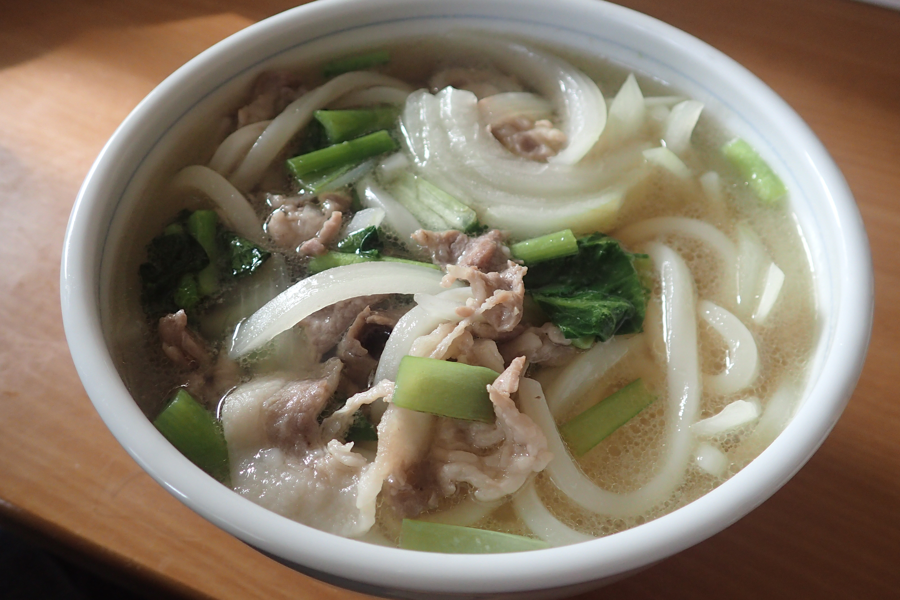

# 豚肉うどん(β)

ご飯がないときに。

比較的短時間でできるあっさり目のうどんです。

## 調理時間
20分前後

## 元ネタ

なし

## 食材(1人前)
- 小松菜：1～2株
- たまねぎ：四分の一玉
- 豚肉：90g前後
- 冷凍うどん：一つ
- つゆ(もう少し薄味にした方が良いかも。調整中)
  - 水：300ml
  - 白だし：30ml
  - みりん：10ml
  - 醤油：2，3滴
  - ごま油：2, 3滴

## 調味料
- サラダ油

## 調理機材
- 鍋

## 手順

### 前準備

- 小松菜を2, 3cmほどの長さに切る
- たまねぎを千切りにする

### 調理手順

1. 鍋に少しサラダ油をしいて、豚肉を炒める
1. 豚肉の色がやや変わってきたら、中火にして小松菜とたまねぎを鍋に入れる
1. 1分ほどしたらつゆを鍋に入れて蓋をし、1～2分ほど待つ
1. 冷凍うどんを入れて、うどん麺がほぐれるまで煮る
1. うどんがしっかりほぐれたらできあがり

## おまけ

合いそうなトッピング案

- ほぐした梅干し
- レモン汁